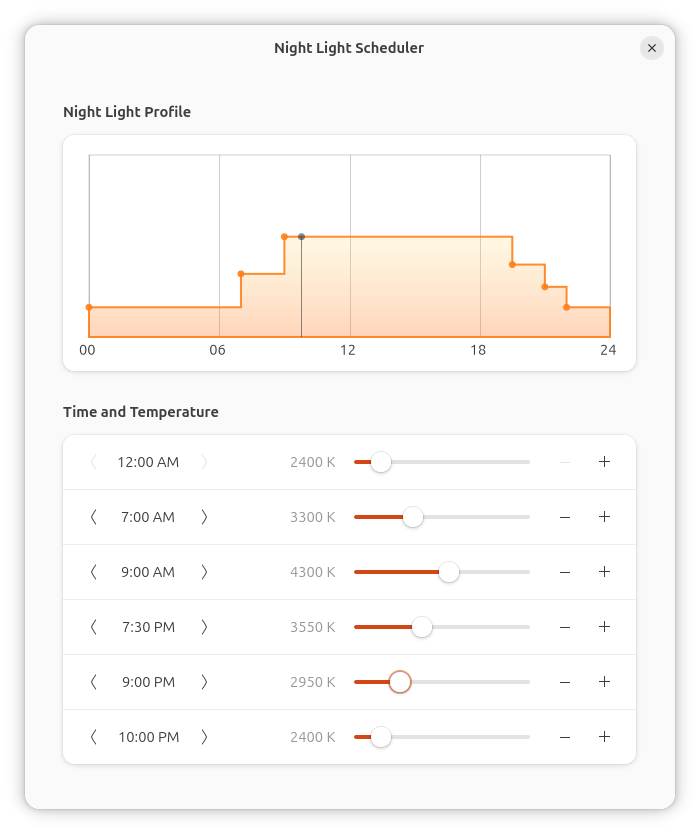

# Night Light Scheduler

#### A GNOME extension for creating a time-of-day schedule for the built-in Night Light.



## Installation

<!--
### Recommended Installation

(not yet available on GNOME Extension)

Browse for and install this extension through the GNOME Extension Manager, or install through the [GNOME Extensions website](https://extensions.gnome.org/extension/).

### Manual Installation
-->

Extension is in beta and not yet published to the GNOME Extensions website. 
To install manually:

1. Download the `night-light-scheduler` file of the [latest release](https://github.com/StorageB/night-light-scheduler/releases). 
2. In the terminal from the download location run:
`gnome-extensions install --force night-light-scheduler.zip`
3. Logout and login.

To enable and configure the extension:
```
gnome-extensions enable night-light-scheduler@storageb.github.com
gnome-extensions prefs night-light-scheduler@storageb.github.com
```

## Configuration

1. Turn on Night Light in the GNOME Settings.
2. Select "Manual Schedule", and set Night Light to be always active (midnight to midnight).
3. Configure your custom schedule through the extension preferences. 