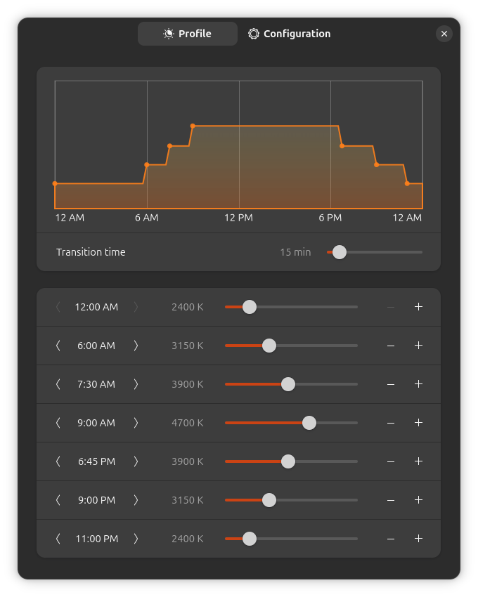

# Night Light Scheduler

#### A GNOME extension for creating a time-of-day schedule for the built-in Night Light.



## Installation

### Recommended

Browse for and install this extension through the GNOME Extension Manager app or the [GNOME Extensions website](https://extensions.gnome.org/extension/9683/night-light-scheduler/).

### Manual Installation

1. Download the `night-light-scheduler.zip` file of the [latest release](https://github.com/StorageB/night-light-scheduler/releases). 
2. In the terminal from the download location run:
`gnome-extensions install --force night-light-scheduler.zip`
3. Logout and login.
4. Enable and configure the extension through the [Extension Manager](https://mattjakeman.com/apps/extension-manager) app or by running:
```
gnome-extensions enable night-light-scheduler@storageb.github.com
gnome-extensions prefs night-light-scheduler@storageb.github.com
```

## Initial Setup

1. Turn on Night Light in GNOME Settings.
2. Select "Manual Schedule", and set Night Light to be always active (midnight to midnight).
3. Configure your custom schedule through the extension preferences.

## Backup and Restore

Use the import/export buttons in the extension preferences to load/save the schedule as an editable `schedule.ini` file in your home directory.

Example `schedule.ini` entry:
```
[schedule]
0:00=2400
6:45=3050
8:00=3900
9:30=4700
18:30=4100
20:30=3200
22:30=2400
```
